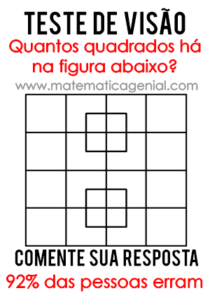

```{r setup, include=FALSE}
knitr::opts_chunk$set(echo = TRUE, cache = FALSE)
# source("./R/pacotes.R")
# source("./R/funcoes-auxiliares.R")
# source("./R/importacao-respostas.R")
```

---

### Quantos anos você acha que a pessoa da foto abaixo tem? 

<center>
<table><tr>
<td> 
<figcaption>Foto 1</figcaption></td>
<td> 
<figcaption>Foto 2</figcaption></td>
</tr></table>
</center>

#### Geral {.tabset .tabset-fade .tabset-pills}

##### Tabela 1

<center>
```{r, comment=FALSE, message=FALSE, fig.align='center', warning=TRUE, echo = FALSE}

quest_24$indica_foto <- c(rep('C/ barba', 100),
                          rep('S/ barba', 100)#,
                          #rep('C/ barba', 117),
                          #rep('S/ barba', 135)
                          ) 

idade_foto <- subset(quest_24, idade_foto >= 18 & idade_foto <= 60)

pander(tab_classes(idade_foto$idade_foto))
```
</center>

---

##### Tabela 2

<center>
```{r, comment=FALSE, message=FALSE, fig.align='center', warning=TRUE, echo = FALSE}
pander(posicao(idade_foto$idade_foto))
pander(dispersao(idade_foto$idade_foto))
```
</center>

---

##### Gráfico 1

```{r, comment=FALSE, message=FALSE, fig.align='center', warning=TRUE, echo = FALSE, warning=FALSE}
table <- as.data.frame(table(idade_foto$idade_foto))
table$Var1 <- as.numeric(as.vector(table$Var1))

# Plot
ggplot(table, aes(x=Var1, y=Freq)) +
  geom_point() + 
  geom_segment(aes(x=Var1, 
                   xend=Var1, 
                   y=0, 
                   yend=Freq),
               lwd = 1.5)+
  xlab("Idade") +
  ylab("Frequência") +
  ggtitle("Idade")+
  theme_classic() + theme(legend.position = 'none',
                          plot.title = element_text(family = "Helvetica", 
                                                    face = "bold", 
                                                    size = (20),
                                                    hjust = 0.5),
                          axis.title = element_text(face = "bold",
                                                    size = 15),
                          text = element_text(size=15)) 
```

---

##### Gráfico 2

```{r, comment=FALSE, message=FALSE, fig.align='center', warning=TRUE, echo = FALSE, warning=FALSE}
ggplot(idade_foto, aes(x=idade_foto)) +
  geom_histogram(col=1,
                 lwd=1,
                 breaks = hist(idade_foto$idade_foto, plot = FALSE)$breaks) + 
  xlab("Idade") +
  ylab("Frequência") +
  ggtitle("Idade")+
  theme_classic() + theme(legend.position = 'none',
                          plot.title = element_text(family = "Helvetica", 
                                                    face = "bold", 
                                                    size = (20),
                                                    hjust = 0.5),
                          axis.title = element_text(face = "bold",
                                                    size = 15),
                          text = element_text(size=15)) 
```

---

##### Gráfico 3

```{r, comment=FALSE, message=FALSE, fig.align='center', warning=TRUE, echo = FALSE, warning=FALSE}
ggplot(data = idade_foto, 
       mapping = aes(y=idade_foto, x='1')) +
  stat_boxplot(geom ='errorbar')+
  geom_boxplot(alpha = 1)+
  stat_summary(fun.y=mean, 
               geom="point", 
               shape=20, 
               size=3, 
               color="red", 
               fill="red")+ 
  xlab("") +
  ylab("") +
  ggtitle("Idade")+
  theme_classic() + theme(legend.position = 'none',
                          plot.title = element_text(family = "Helvetica", 
                                                    face = "bold", 
                                                    size = (20),
                                                    hjust = 0.5),
                          axis.title = element_text(face = "bold",
                                                    size = 15),
                          axis.text.x=element_blank(),
                          text = element_text(size=15)) #+coord_flip()
```

---

##### Gráfico 4

```{r, comment=FALSE, message=FALSE, fig.align='center', warning=TRUE, echo = FALSE, warning=FALSE}
ggplot(data = idade_foto, 
       mapping = aes(y=idade_foto, x='1')) +
  stat_boxplot(geom ='errorbar')+
  geom_boxplot(alpha = 1)+
  stat_summary(fun.y=mean, 
               geom="point", 
               shape=20, 
               size=3, 
               color="red", 
               fill="red")+ 
  ylab("") +
  xlab("") +
  ggtitle("Idade")+
  theme_classic() + theme(legend.position = 'none',
                          plot.title = element_text(family = "Helvetica", 
                                                    face = "bold", 
                                                    size = (20),
                                                    hjust = 0.5),
                          axis.title = element_text(face = "bold",
                                                    size = 15),
                          axis.text.x=element_blank(),
                          text = element_text(size=15)) +
  geom_jitter(col=4, alpha = 0.5) #+coord_flip()
```

---

##### Gráfico 5

```{r, comment=FALSE, message=FALSE, fig.align='center', warning=TRUE, echo = FALSE, warning=FALSE}
ggplot(idade_foto, aes(x=idade_foto)) +
  geom_density(col=1,
               lwd=1) + 
  xlab("Idade") +
  ylab("Densidade") +
  ggtitle("Idade")+
  theme_classic() + theme(legend.position = 'none',
                          plot.title = element_text(family = "Helvetica", 
                                                    face = "bold", 
                                                    size = (20),
                                                    hjust = 0.5),
                          axis.title = element_text(face = "bold",
                                                    size = 15),
                          text = element_text(size=15)) 
```

---

##### Gráfico 6

```{r, comment=FALSE, message=FALSE, fig.align='center', warning=TRUE, echo = FALSE, warning=FALSE}
ggplot(idade_foto) + 
  geom_histogram(aes(x=idade_foto,
                     y=..density..), 
                 position="identity",
                 col = 1,
                 lwd = 1,
                 breaks = hist(idade_foto$idade_foto, plot = FALSE)$breaks) + 
  geom_density(aes(x=idade_foto,
                   y=..density..),
               col = 4,
               lwd = 1) + 
  xlab("Idade") +
  ylab("Densidade") +
  ggtitle("Idade")+
  theme_classic() + theme(legend.position = 'none',
                          plot.title = element_text(family = "Helvetica", 
                                                    face = "bold", 
                                                    size = (20),
                                                    hjust = 0.5),
                          axis.title = element_text(face = "bold",
                                                    size = 15),
                          text = element_text(size=15)) 
```

---

##### Gráfico 7

```{r, comment=FALSE, message=FALSE, fig.align='center', warning=TRUE, echo = FALSE, warning=FALSE}
p1 = ggplot(idade_foto, aes(x=idade_foto)) +
  geom_histogram(col=1,
                 lwd=1,
                 breaks = hist(idade_foto$idade_foto, plot = FALSE)$breaks) + 
  ylab("Frequência") +
  xlab("") +
  ggtitle("Idade")+
  theme_classic() + theme(legend.position = 'none',
                          plot.title = element_text(family = "Helvetica", 
                                                    face = "bold", 
                                                    size = (20),
                                                    hjust = 0.5),
                          axis.title = element_text(face = "bold",
                                                    size = 15),
                          text = element_text(size=15))

p2 = ggplot(data = idade_foto, 
            mapping = aes(y=idade_foto, x='1')) +
  stat_boxplot(geom ='errorbar')+
  geom_boxplot(alpha = 1)+
  stat_summary(fun.y=mean, 
               geom="point", 
               shape=20, 
               size=3, 
               color="red", 
               fill="red")+ 
  ylab("Idade") +
  xlab("") +
  #ggtitle("Titulo")+
  theme_classic() + theme(legend.position = 'none',
                          plot.title = element_text(family = "Helvetica", 
                                                    face = "bold", 
                                                    size = (20),
                                                    hjust = 0.5),
                          axis.title = element_text(face = "bold",
                                                    size = 15),
                          axis.text.y=element_blank(),
                          text = element_text(size=15)) +coord_flip()

ggarrange(p1, p2, 
          heights = c(2, 1), 
          align = "hv", 
          ncol = 1, 
          nrow = 2)
```

---

##### Gráfico 8

```{r, comment=FALSE, message=FALSE, fig.align='center', warning=TRUE, echo = FALSE, warning=FALSE}
p1 = ggplot(idade_foto) + 
  geom_histogram(aes(x=idade_foto,
                     y=..density..), 
                 position="identity",
                 col = 1,
                 lwd = 1,
                 breaks = hist(idade_foto$idade_foto, plot = FALSE)$breaks) + 
  geom_density(aes(x=idade_foto,
                   y=..density..),
               col = 4,
               lwd = 1) + 
  ylab("Densidade") +
  xlab("") +
  ggtitle("Idade")+
  theme_classic() + theme(legend.position = 'none',
                          plot.title = element_text(family = "Helvetica", 
                                                    face = "bold", 
                                                    size = (20),
                                                    hjust = 0.5),
                          axis.title = element_text(face = "bold",
                                                    size = 15),
                          text = element_text(size=15))

p2 = ggplot(data = idade_foto, 
            mapping = aes(y=idade_foto, x='1')) +
  stat_boxplot(geom ='errorbar')+
  geom_boxplot(alpha = 1)+
  stat_summary(fun.y=mean, 
               geom="point", 
               shape=20, 
               size=3, 
               color="red", 
               fill="red")+ 
  ylab("Idade") +
  xlab("") +
  #ggtitle("Titulo")+
  theme_classic() + theme(legend.position = 'none',
                          plot.title = element_text(family = "Helvetica", 
                                                    face = "bold", 
                                                    size = (20),
                                                    hjust = 0.5),
                          axis.title = element_text(face = "bold",
                                                    size = 15),
                          axis.text.y=element_blank(),
                          text = element_text(size=15)) +coord_flip()

ggarrange(p1, p2, 
          heights = c(2, 1), 
          align = "hv", 
          ncol = 1, 
          nrow = 2)
```

---

#### Entre fotos {.tabset .tabset-fade .tabset-pills}

##### Tabela 1

<center>
```{r, comment=FALSE, message=FALSE, fig.align='center', warning=FALSE, echo = FALSE}
idade_foto1 <- subset(idade_foto, indica_foto == 'C/ barba')$idade_foto

idade_foto2 <- subset(idade_foto, indica_foto == 'S/ barba')$idade_foto

h <- hist(idade_foto$idade_foto, plot = FALSE) #histograma

breaks <- h$breaks #armazenando os breaks do histograma 

classes1 <- cut(idade_foto1, breaks = breaks, 
                include.lowest = TRUE, right = TRUE) #gerando classes

classes2 <- cut(idade_foto2, breaks = breaks, 
                include.lowest = TRUE, right = TRUE) #gerando classes

table <- as.data.frame(table(classes1)) #gerando tabela com faixas

table$Freq2 <- as.data.frame(table(classes2))$Freq

names(table) <- c('Classes', 'C/ barba', 'S/ barba')

pander(table)

```
</center>

---

##### Tabela 2

<center>
```{r, comment=FALSE, message=FALSE, fig.align='center', warning=TRUE, echo = FALSE}
pos <- rbind(posicao(subset(idade_foto, indica_foto == 'C/ barba')$idade_foto),
             posicao(subset(idade_foto, indica_foto == 'S/ barba')$idade_foto))

row.names(pos) <- c('C/ barba', 'S/ barba')

pander(pos)


disp <- rbind(dispersao(subset(idade_foto, indica_foto == 'C/ barba')$idade_foto),
             dispersao(subset(idade_foto, indica_foto == 'S/ barba')$idade_foto))

row.names(disp) <- c('C/ barba', 'S/ barba')

pander(disp)
```
</center>

---

##### Gráfico 1

```{r, comment=FALSE, message=FALSE, fig.align='center', warning=TRUE, echo = FALSE, warning=FALSE}
ggplot(idade_foto, aes(x=idade_foto)) +
  geom_histogram(col=1,
                 lwd=1,
                 breaks = hist(idade_foto$idade_foto, plot = FALSE)$breaks) + 
  xlab("Idade") +
  ylab("Frequência") +
  ggtitle("Idade")+
  theme_bw() + theme(legend.position = 'none',
                          plot.title = element_text(family = "Helvetica", 
                                                    face = "bold", 
                                                    size = (20),
                                                    hjust = 0.5),
                          axis.title = element_text(face = "bold",
                                                    size = 15),
                          text = element_text(size=15)) +facet_wrap(~indica_foto, nrow = 2)
```

---

##### Gráfico 2

```{r, comment=FALSE, message=FALSE, fig.align='center', warning=TRUE, echo = FALSE, warning=FALSE}
ggplot(data = idade_foto, 
       mapping = aes(y=idade_foto, x='1')) +
  stat_boxplot(geom ='errorbar')+
  geom_boxplot(alpha = 1)+
  stat_summary(fun.y=mean, 
               geom="point", 
               shape=20, 
               size=3, 
               color="red", 
               fill="red")+ 
  xlab("") +
  ylab("") +
  ggtitle("Idade")+
  theme_bw() + theme(legend.position = 'none',
                          plot.title = element_text(family = "Helvetica", 
                                                    face = "bold", 
                                                    size = (20),
                                                    hjust = 0.5),
                          axis.title = element_text(face = "bold",
                                                    size = 15),
                          axis.text.y=element_blank(),
                          text = element_text(size=15)) +coord_flip() + facet_wrap(~indica_foto, nrow = 2)
```

---

##### Gráfico 3

```{r, comment=FALSE, message=FALSE, fig.align='center', warning=TRUE, echo = FALSE, warning=FALSE}
ggplot(idade_foto, aes(x=idade_foto, col = indica_foto)) +
  geom_density(lwd=1) + 
  xlab("Idade") +
  ylab("Densidade") +
  ggtitle("Idade")+
  theme_classic() + theme(legend.position = 'top',
                          legend.title = element_blank(),
                          plot.title = element_text(family = "Helvetica", 
                                                    face = "bold", 
                                                    size = (20),
                                                    hjust = 0.5),
                          axis.title = element_text(face = "bold",
                                                    size = 15),
                          text = element_text(size=15)) 
```

---

##### Gráfico 4

```{r, comment=FALSE, message=FALSE, fig.align='center', warning=TRUE, echo = FALSE, warning=FALSE}
p1 = ggplot(idade_foto, aes(x=idade_foto)) +
  geom_histogram(col=1,
                 lwd=1,
                 breaks = hist(idade_foto$idade_foto, plot = FALSE)$breaks) + 
  ylab("Frequência") +
  xlab("") +
  ggtitle("Idade")+
  theme_bw() + theme(legend.position = 'none',
                          plot.title = element_text(family = "Helvetica", 
                                                    face = "bold", 
                                                    size = (20),
                                                    hjust = 0.5),
                          axis.title = element_text(face = "bold",
                                                    size = 15),
                          text = element_text(size=15)) + facet_wrap(~indica_foto)

p2 = ggplot(data = idade_foto, 
            mapping = aes(y=idade_foto, x='1')) +
  stat_boxplot(geom ='errorbar')+
  geom_boxplot(alpha = 1)+
  stat_summary(fun.y=mean, 
               geom="point", 
               shape=20, 
               size=3, 
               color="red", 
               fill="red")+ 
  ylab("Idade") +
  xlab("") +
  #ggtitle("Titulo")+
  theme_bw() + theme(legend.position = 'none',
                          plot.title = element_text(family = "Helvetica", 
                                                    face = "bold", 
                                                    size = (20),
                                                    hjust = 0.5),
                          axis.title = element_text(face = "bold",
                                                    size = 15),
                          axis.text.y=element_blank(),
                          text = element_text(size=15)) +coord_flip() + facet_wrap(~indica_foto)

ggarrange(p1, p2, 
          heights = c(2, 1), 
          align = "hv", 
          ncol = 1, 
          nrow = 2)
```

---

### Observe as figuras abaixo. Uma delas se chama "Bouba" e a outra "Kiki". Quem é quem? {.tabset .tabset-fade .tabset-pills}

<center>

</center>

---

Não há resposta certa! Entenda: https://www.bbc.com/portuguese/geral-39685606.

```{r, echo=FALSE}

## 2024
quest_24$kiki_bouba <- tolower(iconv(quest_24$kiki_bouba,
                                      to ='ASCII//TRANSLIT', 
                                      from = "UTF-8"))

quest_24$kiki_bouba <- factor(quest_24$kiki_bouba, 
                               levels = tolower(c("A da esquerda se chama Bouba, a da direita se chama Kiki.", 
                                                  "A da esquerda se chama Kiki, a da direita se chama Bouba.")))

#----------------------------------------------------------------------

## 2023
quest_23$kiki_bouba <- tolower(iconv(quest_23$kiki_bouba,
                                      to ='ASCII//TRANSLIT', 
                                      from = "UTF-8"))

quest_23$kiki_bouba <- factor(quest_23$kiki_bouba, 
                               levels = tolower(c("A da esquerda se chama Bouba, a da direita se chama Kiki.", 
                                                  "A da esquerda se chama Kiki, a da direita se chama Bouba.")))

#----------------------------------------------------------------------

## 2022
quest_22$kiki_bouba <- tolower(iconv(quest_22$kiki_bouba,
                                      to ='ASCII//TRANSLIT', 
                                      from = "UTF-8"))

quest_22$kiki_bouba <- factor(quest_22$kiki_bouba, 
                               levels = tolower(c("A da esquerda se chama Bouba, a da direita se chama Kiki.", 
                                                  "A da esquerda se chama Kiki, a da direita se chama Bouba.")))

#----------------------------------------------------------------------

## 2021
quest_21$kiki_bouba <- tolower(iconv(quest_21$kiki_bouba,
                                      to ='ASCII//TRANSLIT', 
                                      from = "UTF-8"))

quest_21$kiki_bouba <- factor(quest_21$kiki_bouba, 
                               levels = tolower(c("A da esquerda se chama Bouba, a da direita se chama Kiki.", 
                                                  "A da esquerda se chama Kiki, a da direita se chama Bouba.")))

#----------------------------------------------------------------------

## 2020
quest_20$ln_kiki <- tolower(iconv(quest_20$ln_kiki,
                                      to ='ASCII//TRANSLIT', 
                                      from = "UTF-8"))

quest_20$ln_kiki <- factor(quest_20$ln_kiki, 
                               levels = c("a se chama bouba e b se chama kiki.", "b se chama bouba e a se chama kiki."))

#----------------------------------------------------------------------

# tabela

table1 <- freq_n_ord(quest_24$kiki_bouba)
```

---

#### Tabela

<center>
```{r, comment=FALSE, message=FALSE, fig.align='center', warning=TRUE, echo = FALSE}

pander::pander(table1)
```
</center>

---

#### Gráfico

```{r, comment=FALSE, message=FALSE, fig.align='center', warning=TRUE, echo = FALSE}

table1$Niveis <- c('Bouba/Kiki', 'Kiki/Bouba')

ggplot(data=table1, aes(x=reorder(Niveis, -Frequencia), 
                       y=Frequencia#, 
                       #fill = Niveis
                       )) + 
  geom_bar(stat="identity", 
           col=1,
           lwd=1)+
  ylim(c(0, 
         (max(table1$Frequencia)+ (max(table1$Frequencia)*0.3))))+
  geom_text(aes(label=Frequencia), 
            vjust=-1, 
            color=1, 
            size=8)+
  ylab("Frequência") +
  xlab("") +
  ggtitle("Efeito Kiki Bouba")+
  theme_classic() + theme(legend.position = 'none',
    plot.title = element_text(family = "Helvetica", 
                              face = "bold", 
                              size = (20),
                              hjust = 0.5),
    axis.title = element_text(face = "bold",
                              size = 15),
    #axis.text = element_blank(),
    legend.title = element_blank(),
    text = element_text(size=15)) 
```

---

#### Comparativo

```{r, comment=FALSE, message=FALSE, fig.align='center', warning=TRUE, echo = FALSE}

compara <- rbind(freq_n_ord(quest_24$kiki_bouba),
                 freq_n_ord(quest_23$kiki_bouba),
                 freq_n_ord(quest_22$kiki_bouba),
                 freq_n_ord(quest_21$kiki_bouba),
                 freq_n_ord(quest_20$ln_kiki))

compara$Niveis <- c('Bouba/Kiki', 'Kiki/Bouba')

compara$Ano <- c(rep('2024',2),
                 rep('2023',2),
                 rep('2022',2),
                 rep('2021',2), 
                 rep('2020',2))

compara$Frequencia.relativa <- round(compara$Frequencia.relativa,2)

ggplot(data = compara,
       mapping = aes(x = Ano,
                     y = Frequencia.relativa,
                     group = Niveis,
                     col = Niveis)) + 
  geom_line() + geom_point()+
  ylab("Proporção") +
  xlab("") +
  ggtitle("Instituição")+
  theme_classic() + theme(legend.position = 'top',
                          plot.title = element_text(family = "Helvetica", 
                                                    face = "bold", 
                                                    size = (20),
                                                    hjust = 0.5),
                          axis.title = element_text(face = "bold",
                                                    size = 15),
                          text = element_text(size=20)) +
  theme(legend.title=element_blank())

```

---

### Quantos quadrados há na figura? {.tabset .tabset-fade .tabset-pills}

<center>

</center>

---

A resposta certa é: 40. Confira: https://www.youtube.com/watch?v=EN61RHZcHTc.

---

#### Tabela 1

<center>
```{r, comment=FALSE, message=FALSE, fig.align='center', warning=TRUE, echo = FALSE}

quadrados <- subset(quest_24, quadrados > 0)

pander(tab_classes(quadrados$quadrados))
```
</center>

---

#### Tabela 2

<center>
```{r, comment=FALSE, message=FALSE, fig.align='center', warning=TRUE, echo = FALSE}
pander(posicao(quadrados$quadrados))
pander(dispersao(quadrados$quadrados))
```
</center>

---

#### Gráfico 1

```{r, comment=FALSE, message=FALSE, fig.align='center', warning=TRUE, echo = FALSE, warning=FALSE}
table <- as.data.frame(table(quadrados$quadrados))
table$Var1 <- as.numeric(as.vector(table$Var1))

# Plot
ggplot(table, aes(x=Var1, y=Freq)) +
  geom_point() + 
  geom_segment(aes(x=Var1, 
                   xend=Var1, 
                   y=0, 
                   yend=Freq),
               lwd = 1.5)+
  xlab("Número de quadrados") +
  ylab("Frequência") +
  ggtitle("Quadrados")+
  theme_classic() + theme(legend.position = 'none',
                          plot.title = element_text(family = "Helvetica", 
                                                    face = "bold", 
                                                    size = (20),
                                                    hjust = 0.5),
                          axis.title = element_text(face = "bold",
                                                    size = 15),
                          text = element_text(size=15)) 
```

---

#### Gráfico 2

```{r, comment=FALSE, message=FALSE, fig.align='center', warning=TRUE, echo = FALSE, warning=FALSE}
ggplot(quadrados, aes(x=quadrados)) +
  geom_histogram(col=1,
                 lwd=1,
                 breaks = hist(quadrados$quadrados, plot = FALSE)$breaks) + 
  xlab("Número de quadrados") +
  ylab("Frequência") +
  ggtitle("Quadrados")+
  theme_classic() + theme(legend.position = 'none',
                          plot.title = element_text(family = "Helvetica", 
                                                    face = "bold", 
                                                    size = (20),
                                                    hjust = 0.5),
                          axis.title = element_text(face = "bold",
                                                    size = 15),
                          text = element_text(size=15)) 
```

---

#### Gráfico 3

```{r, comment=FALSE, message=FALSE, fig.align='center', warning=TRUE, echo = FALSE, warning=FALSE}
ggplot(data = quadrados, 
       mapping = aes(y=quadrados, x='1')) +
  stat_boxplot(geom ='errorbar')+
  geom_boxplot(alpha = 1)+
  stat_summary(fun.y=mean, 
               geom="point", 
               shape=20, 
               size=3, 
               color="red", 
               fill="red")+ 
  xlab("") +
  ylab("") +
  ggtitle("Número de quadrados")+
  theme_classic() + theme(legend.position = 'none',
                          plot.title = element_text(family = "Helvetica", 
                                                    face = "bold", 
                                                    size = (20),
                                                    hjust = 0.5),
                          axis.title = element_text(face = "bold",
                                                    size = 15),
                          axis.text.x=element_blank(),
                          text = element_text(size=15)) #+coord_flip()
```

---

#### Gráfico 4

```{r, comment=FALSE, message=FALSE, fig.align='center', warning=TRUE, echo = FALSE, warning=FALSE}
ggplot(data = quadrados, 
       mapping = aes(y=quadrados, x='1')) +
  stat_boxplot(geom ='errorbar')+
  geom_boxplot(alpha = 1)+
  stat_summary(fun.y=mean, 
               geom="point", 
               shape=20, 
               size=3, 
               color="red", 
               fill="red")+ 
  ylab("") +
  xlab("") +
  ggtitle("Número de quadrados")+
  theme_classic() + theme(legend.position = 'none',
                          plot.title = element_text(family = "Helvetica", 
                                                    face = "bold", 
                                                    size = (20),
                                                    hjust = 0.5),
                          axis.title = element_text(face = "bold",
                                                    size = 15),
                          axis.text.x=element_blank(),
                          text = element_text(size=15)) +
  geom_jitter(col=4, alpha = 0.5) #+coord_flip()
```

---

#### Gráfico 5

```{r, comment=FALSE, message=FALSE, fig.align='center', warning=TRUE, echo = FALSE, warning=FALSE}
ggplot(quadrados, aes(x=quadrados)) +
  geom_density(col=1,
               lwd=1) + 
  xlab("Número de quadrados") +
  ylab("Densidade") +
  ggtitle("Quadrados")+
  theme_classic() + theme(legend.position = 'none',
                          plot.title = element_text(family = "Helvetica", 
                                                    face = "bold", 
                                                    size = (20),
                                                    hjust = 0.5),
                          axis.title = element_text(face = "bold",
                                                    size = 15),
                          text = element_text(size=15)) 
```

---

#### Gráfico 6

```{r, comment=FALSE, message=FALSE, fig.align='center', warning=TRUE, echo = FALSE, warning=FALSE}
ggplot(quadrados) + 
  geom_histogram(aes(x=quadrados,
                     y=..density..), 
                 position="identity",
                 col = 1,
                 lwd = 1,
                 breaks = hist(quadrados$quadrados, plot = FALSE)$breaks) + 
  geom_density(aes(x=quadrados,
                   y=..density..),
               col = 4,
               lwd = 1) + 
  xlab("Número de quadrados") +
  ylab("Densidade") +
  ggtitle("Quadrados")+
  theme_classic() + theme(legend.position = 'none',
                          plot.title = element_text(family = "Helvetica", 
                                                    face = "bold", 
                                                    size = (20),
                                                    hjust = 0.5),
                          axis.title = element_text(face = "bold",
                                                    size = 15),
                          text = element_text(size=15)) 
```

---

#### Gráfico 7

```{r, comment=FALSE, message=FALSE, fig.align='center', warning=TRUE, echo = FALSE, warning=FALSE}
p1 = ggplot(quadrados, aes(x=quadrados)) +
  geom_histogram(col=1,
                 lwd=1,
                 breaks = hist(quadrados$quadrados, plot = FALSE)$breaks) + 
  ylab("Frequência") +
  xlab("") +
  ggtitle("Quadrados")+
  theme_classic() + theme(legend.position = 'none',
                          plot.title = element_text(family = "Helvetica", 
                                                    face = "bold", 
                                                    size = (20),
                                                    hjust = 0.5),
                          axis.title = element_text(face = "bold",
                                                    size = 15),
                          text = element_text(size=15))

p2 = ggplot(data = quadrados, 
            mapping = aes(y=quadrados, x='1')) +
  stat_boxplot(geom ='errorbar')+
  geom_boxplot(alpha = 1)+
  stat_summary(fun.y=mean, 
               geom="point", 
               shape=20, 
               size=3, 
               color="red", 
               fill="red")+ 
  ylab("Número de quadrados") +
  xlab("") +
  #ggtitle("Titulo")+
  theme_classic() + theme(legend.position = 'none',
                          plot.title = element_text(family = "Helvetica", 
                                                    face = "bold", 
                                                    size = (20),
                                                    hjust = 0.5),
                          axis.title = element_text(face = "bold",
                                                    size = 15),
                          axis.text.y=element_blank(),
                          text = element_text(size=15)) +coord_flip()

ggarrange(p1, p2, 
          heights = c(2, 1), 
          align = "hv", 
          ncol = 1, 
          nrow = 2)
```

---

#### Gráfico 8

```{r, comment=FALSE, message=FALSE, fig.align='center', warning=TRUE, echo = FALSE, warning=FALSE}
p1 = ggplot(quadrados) + 
  geom_histogram(aes(x=quadrados,
                     y=..density..), 
                 position="identity",
                 col = 1,
                 lwd = 1,
                 breaks = hist(quadrados$quadrados, plot = FALSE)$breaks) + 
  geom_density(aes(x=quadrados,
                   y=..density..),
               col = 4,
               lwd = 1) + 
  ylab("Densidade") +
  xlab("") +
  ggtitle("Quadrados")+
  theme_classic() + theme(legend.position = 'none',
                          plot.title = element_text(family = "Helvetica", 
                                                    face = "bold", 
                                                    size = (20),
                                                    hjust = 0.5),
                          axis.title = element_text(face = "bold",
                                                    size = 15),
                          text = element_text(size=15))

p2 = ggplot(data = quadrados, 
            mapping = aes(y=quadrados, x='1')) +
  stat_boxplot(geom ='errorbar')+
  geom_boxplot(alpha = 1)+
  stat_summary(fun.y=mean, 
               geom="point", 
               shape=20, 
               size=3, 
               color="red", 
               fill="red")+ 
  ylab("Número de quadrados") +
  xlab("") +
  #ggtitle("Titulo")+
  theme_classic() + theme(legend.position = 'none',
                          plot.title = element_text(family = "Helvetica", 
                                                    face = "bold", 
                                                    size = (20),
                                                    hjust = 0.5),
                          axis.title = element_text(face = "bold",
                                                    size = 15),
                          axis.text.y=element_blank(),
                          text = element_text(size=15)) +coord_flip()

ggarrange(p1, p2, 
          heights = c(2, 1), 
          align = "hv", 
          ncol = 1, 
          nrow = 2)
```

---

###


<center>

<table><tr>

<td>  </td>

<td> &nbsp; &nbsp; &nbsp; &nbsp; &nbsp; &nbsp; </td>

<td>  </td>

<td> &nbsp; &nbsp; &nbsp; &nbsp; &nbsp; &nbsp; </td>

<td>  </td>

</center>


<div class="tocify-extend-page" data-unique="tocify-extend-page" style="height: 0;"></div>